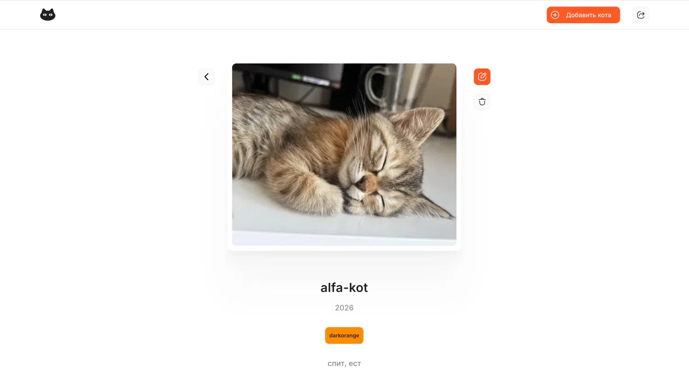
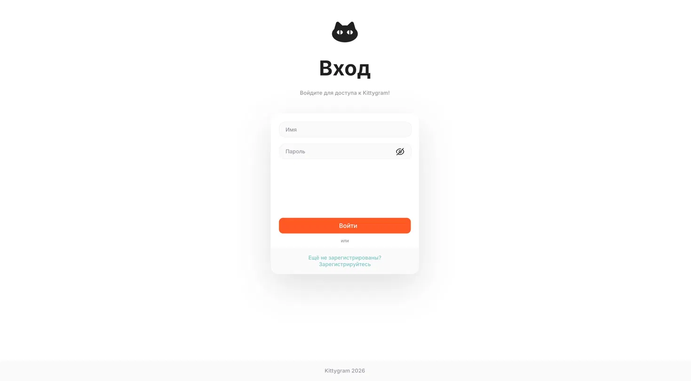
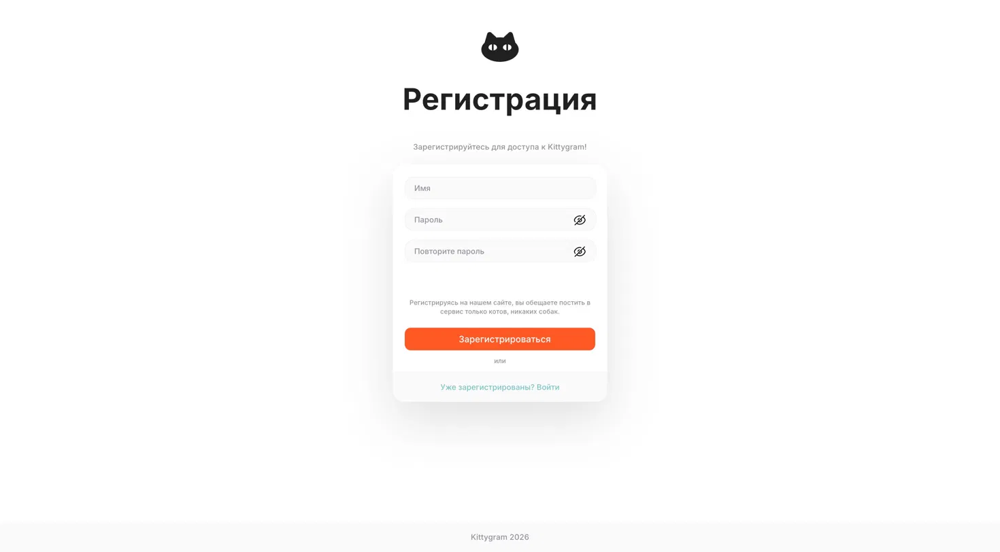
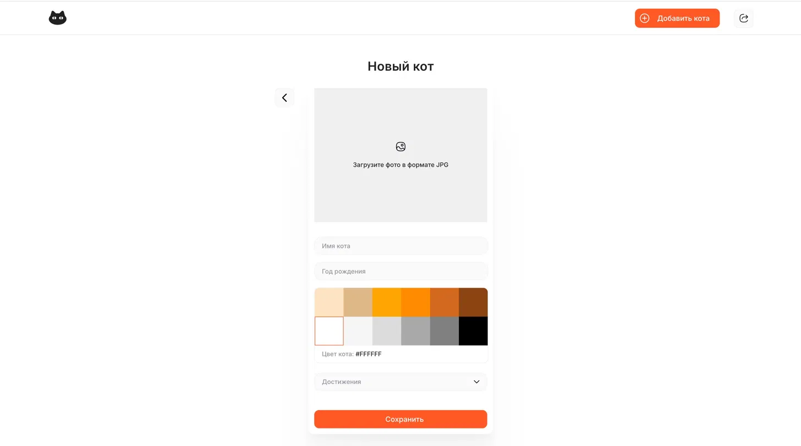
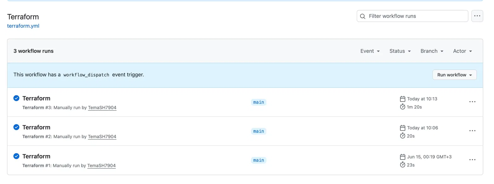
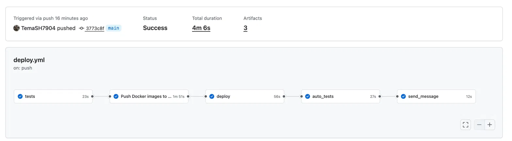
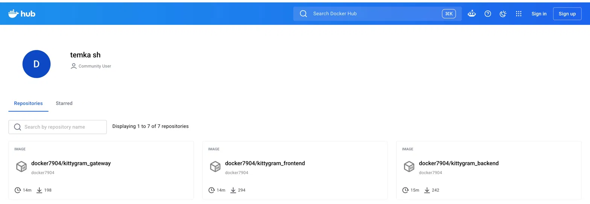

# Kittygram — деплой в Yandex Cloud (Terraform + CI/CD)

Kittygram — социальная сеть для котиков: пользователи регистрируются, добавляют своих котов с фотографией, годом рождения, цветом и списком достижений. Проект развёрнут в **Yandex Cloud**: вся инфраструктура описана через **Terraform** (Infrastructure as Code), а сборка образов и деплой автоматизированы через **GitHub Actions**.

🔗 **Приложение доступно по адресу:** http://51.250.67.132:9000

---

## Доступ к проекту

**Приложение:** http://51.250.67.132:9000

Регистрация открыта — можно создать аккаунт прямо на сайте и добавить своего котика.

---

## Возможности приложения

- Регистрация и авторизация пользователей
- Добавление, редактирование и удаление котиков
- Загрузка фотографии кота (медиафайлы)
- Выбор цвета кота и списка достижений

<table>
  <tr>
    <td></td>
    <td></td>
    <td></td>
  </tr>
  <tr>
    <td align="center">Вход</td>
    <td align="center">Регистрация</td>
    <td align="center">Добавление кота</td>
  </tr>
</table>

---

## Стек технологий

**Backend:** Python, Django, Django REST Framework, Gunicorn, PostgreSQL
**Frontend:** React
**Инфраструктура:** Docker, Docker Compose, nginx (gateway)
**Облако и IaC:** Yandex Cloud (Compute, VPC, Object Storage), Terraform
**CI/CD:** GitHub Actions
**Реестр образов:** Docker Hub

---

## Архитектура

Приложение состоит из трёх контейнеров, объединённых через nginx-шлюз:

- **backend** — Django + Gunicorn, отдаёт API (`/api/`) и админку (`/admin/`)
- **frontend** — React-приложение, собирается и складывает статику в общий том
- **gateway** — nginx, принимает запросы на порту `9000`, проксирует `/api/` и `/admin/` на backend, отдаёт статику фронтенда и медиафайлы
- **db** — PostgreSQL, данные хранятся в именованном томе

Статика фронтенда и Django, а также медиафайлы передаются между контейнерами через общие тома Docker.

---

## Инфраструктура (Terraform)

Вся облачная инфраструктура описана в каталоге `infra/` и поднимается одной командой. Terraform создаёт:

- **VPC-сеть и подсеть** в зоне `ru-central1-a`
- **Группу безопасности** — входящий трафик только по портам `22` (SSH) и `9000` (приложение), исходящий — без ограничений
- **Виртуальную машину** (Compute Cloud, Ubuntu 24.04) с установкой Docker через **cloud-init**
- **Бакет в Object Storage** (S3)

Состояние Terraform (`tfstate`) хранится в отдельном S3-бакете Yandex Object Storage.

---

## CI/CD (GitHub Actions)

В репозитории два workflow:

**`terraform.yml`** — ручной запуск (`workflow_dispatch`) для управления инфраструктурой: `plan`, `apply` или `destroy`.

**`deploy.yml`** — запускается автоматически при push в ветку `main` и проходит этапы:

1. **tests** — проверка кода линтером flake8
2. **build_and_push** — сборка и публикация трёх образов (backend, frontend, gateway) в Docker Hub
3. **deploy** — копирование `docker-compose.production.yml` на сервер, создание `.env`, `pull` образов, запуск контейнеров, миграции и сбор статики
4. **auto_tests** — автотесты проекта по живому адресу
5. **send_message** — уведомление об успешном деплое в Telegram

Образы публикуются в Docker Hub:

---

## Как развернуть

1. Создать сервисный аккаунт в Yandex Cloud со статическим ключом доступа и бакет для tfstate.
2. Прописать секреты репозитория на GitHub (`Settings → Secrets and variables → Actions`):
   - Для Terraform: `ACCESS_KEY`, `SECRET_KEY`, `YC_KEY`, `YC_CLOUD_ID`, `YC_FOLDER_ID`, `BUCKET_NAME`, `SSH_PUBLIC_KEY`
   - Для деплоя: `HOST`, `USER`, `SSH_KEY`, `DOCKER_USERNAME`, `DOCKER_PASSWORD`, `POSTGRES_DB`, `POSTGRES_USER`, `POSTGRES_PASSWORD`, `TELEGRAM_TO`, `TELEGRAM_TOKEN`
3. Запустить workflow **Terraform** с действием `apply` — поднимется ВМ, в выводе будет её IP.
4. Указать IP в секрете `HOST` и в файле `tests.yml`.
5. Сделать push в `main` — запустится деплой, и приложение станет доступно по `http://<IP>:9000`.

---

## Автор

[TemaSH7904](https://github.com/TemaSH7904)
